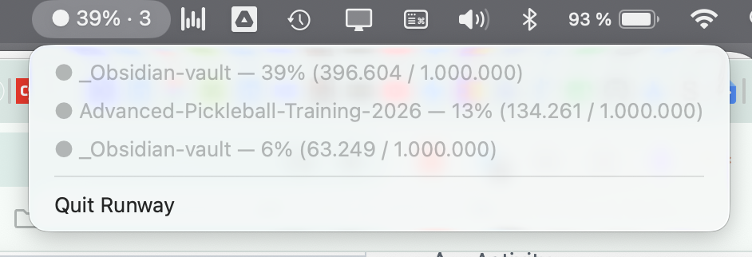

# Runway

A tiny macOS menubar app that shows how full the context window of every active Claude Code session is — before a session unexpectedly runs out of room.

When you run several Claude Code sessions, you can't see how close any of them is to filling its context window until it starts dropping earlier messages. Runway makes that visible at a glance (● / 🟡 / 🔴 + percent) and warns you per session at 60% and 80%, so you can wrap up or start fresh in time.



## What it looks like

- The menubar shows the **fullest** active session; with several open, it appends the count — e.g. `🟡 72% · 3` (that's the max, not a sum).
- Clicking opens a dropdown with every active session: project name, percent, absolute token count.
- Sessions with no activity for 10 minutes drop off the menubar and dropdown automatically.

## How it works

- Reads `~/.claude/projects/**/*.jsonl` (Claude Code session logs), polling every 15s.
- A session counts as active if its log file was written in the last 10 minutes; subagent logs are skipped.
- Context = `input_tokens + cache_creation_input_tokens + cache_read_input_tokens` from the last assistant line.
- Context window per model: Opus / Sonnet / Fable / Mythos → 1M, Haiku → 200K, unknown → 200K (conservative).
- The project name comes from the `cwd` field in the session log.
- Notifications fire once per threshold crossing (60% yellow, 80% red), tracked per session.
- **First run:** on the first warning, macOS asks for notification permission for Runway — allow it, or the warnings won't come through.

It only reads the start of each log (for `cwd`) and the end (for the latest usage) rather than whole files, so it stays cheap even with large sessions.

## Requirements

macOS. Python 3. There's no prebuilt binary — you build the app bundle from source (below).

## Build & install

```bash
git clone https://github.com/volkermaxmeyer/runway.git
cd runway
python3 -m venv venv
./venv/bin/pip install -r requirements.txt

./venv/bin/python runway.py          # run directly, without an app bundle
./venv/bin/python make_icon.py       # regenerate icon.icns
./venv/bin/python setup.py py2app    # build the bundle → dist/Runway.app

# install into /Applications
pkill -x Runway; ditto dist/Runway.app /Applications/Runway.app
touch /Applications/Runway.app       # required: ditto keeps the old bundle date, so macOS caches the old icon
open /Applications/Runway.app
```

Runway is menubar-only (no Dock icon). For autostart, add it as a Login Item (System Settings → General → Login Items).

## Tech

- [`rumps`](https://github.com/jaredks/rumps) for the menubar, [`py2app`](https://py2app.readthedocs.io/) for the bundle, [`pillow`](https://python-pillow.org/) for the icon.
- Single file: `runway.py`.
- Built with [Claude Code](https://claude.com/claude-code) — see `CLAUDE.md` for the project context.

## Version history

- **V1.2.3** (2026-07-21) — running version now shown in the menu (read from the bundle, so `setup.py` stays the single source); added a `Makefile` (`make install` builds and deploys to `/Applications` in one step) to prevent source/binary drift
- **V1.2.2** (2026-07-06) — fixed a flicker where open sessions briefly vanished if idle for a few seconds; process liveness is now the sole source of truth for "active"
- **V1.2.1** (2026-07-06) — active-session detection now cross-checks running claude processes, fixing stale display after restart
- **V1.2.0** (2026-07-05) — session count in the menubar
- **V1.1.1** (2026-07-05) — custom sneaker icon
- **V1.1** (2026-07-04) — renamed to "Runway"
- **V1** (2026-05-15) — first release as "token-tracker" (AI Makers Club, Week 002)

Releases are git-tagged (`vX.Y.Z`).

## License

MIT — see [LICENSE](LICENSE).
